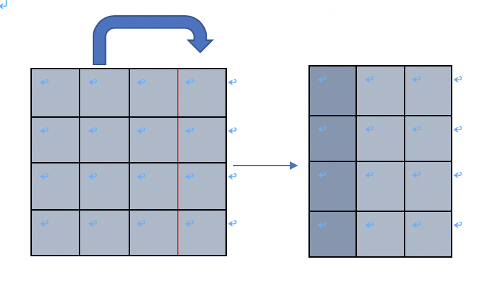

# 問題
折り紙  
URL:https://onlinejudge.u-aizu.ac.jp/challenges/sources/ICPC/Prelim/1625

### 問題概要
縦m、横nの折り紙があります。はじめに、この折り紙を指示に従って折ります。次に、その折り紙に針を刺した時に、何枚の紙に貫通するかをそれぞれ出力してください。（大まかな題意）

---

# 解法
ひたすら添字に気をつけながら、シミュレーションをする問題です。配列の操作を理解しているかを試される問題です。  
多分解法は人によって微妙に違っていて、十人十色の解答が生まれると思いますが、個人的な見解を紹介します。  

この問題の難しいところは
* 紙が何枚重なっているかという情報の持ち方
* 折る操作の実装
* (折り紙上での)原点が動的に変わる

この辺りだと思います。

### 紙の重なり情報の持ち方と初期化
折り紙のサイズと同じサイズの２次元配列を用意して、その要素が折り紙の各マスにおける枚数を意味する、と考えます。  
しかし、何も考えずにやると以下のような場合にうまくいきません。  

このような場合には、仮に折り紙と同じサイズの配列を確保していても、右側に大きくはみ出すので配列外参照になります。  
これを回避するために、大きめに1000*1000くらいの配列を確保しておきましょう。また、はじめは何もない空間という意味で、0で初期化します。
~~~
vector<vector<int> >  v(1000,vector<int>(1000,0));  //1000*1000の配列を0で初期化
~~~

次に、この空間に折り紙を置きましょう。先程説明したように、折る操作にははみ出す危険性がありますが、折り方の定義から上、または右にはみ出すしかありません。よって、折り紙は空間の左下に沿うように置きます。この置く操作は、用意した配列の左下に沿うように`1`を入れる操作と等しいです。
~~~
for(int i=0;i<h;i++){
    for(int j=0;j<w;j++){
        v[1000-i-1][j]=1;
    }
}
~~~
以上により、現在の配列の状態は下のようになります
~~~
000......000
000......000
11..1100..00
11..1100..00
..........
11..1100..00
~~~
もうちょっと具体的に言うと、例えば3*4の折り紙を置いてみれば
~~~
00....00
00....00
........
11110..0
11110..0
11110..0
~~~
となります。

### 折るという操作
折る操作は、どこのマス目がどこのマス目と重なるか、に注目すれば良いです。この時、横におるにしろ縦に折るにしろ、ある基準座標cが存在して、(c-1,c),(c-2,c+1),(c-3,c+2)...(c-x-1,c+x)が重なることが分かります。ここでのcは、x座標でもy座標でも、どっちとも思っていただいて大丈夫です。  

もう少し具体的に、単なる数直線を折ることを考えます。  
いま、[1,2,3,4,5,6]という数直線があって、c=3であるとします。つまり、折る基準が3と4の間にあります。  
この時は、**値で言えば**{(3,4),(2,5),(1,6)} の組みがそれぞれ合わさります。また、**添字で言えば**{(2,3),(1,4),(0,5)}がそれぞれ合わさります。

さて、先の数直線の話というのは、そのままd=1で横向きに折る操作そのものだと考えることができます。数直線というのは１次元配列なので、これを２次元配列にすれば良いです。

対して、縦向きのときは少しめんどくさいです。原因は対象とする原点の違いにあって、折り紙上における原点は（数学みたいな）**右下**で、プログラムにおける原点は(processingみたいな)**左上**にあることにあります。

というわけで、原点自体も自分で作ってしまいます。

### (折り紙上での)原点

